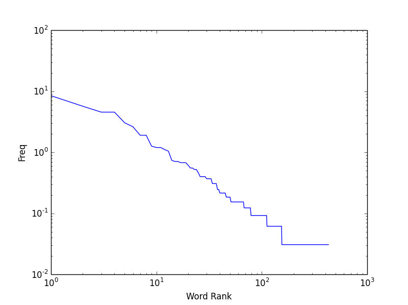

# Twitters Reaction to the Affordable Care Act

## Introduction

Twitter can be used to gauge the impact of certain topics and the effectiveness of certain add
campaigns.  Many advertising agencies and political consulting firms relay on the mining of twitter to 
calculate the sentiment of marketing campaigns.  Due to twitters robust api it is possible for 
individuals to effectively search for trending topics and analyze them for effectiveness.
An important topic currently in American politics considers the affordable care act. This is new 
healthcare law in the united states that changes the requirements and laws regarding the purchase and
administration of health insurance.    Many different opinions exist about the implementation of this
law and a conversation has been brewing on twitter because of it. By taking a snapshot of this
conversion we can gain an initial understanding  about this conversation.  

## Methods

The twitter api was accessed using the search function to gather 1000 tweets related to a particular
query.  The three query used were healthcare.gov, obamacare, and affordablecareact, these terms
were selected due to them being most related to the healthcare law.  Each one of the tweets was
filtered by screen name, hashtag, and text and analysis was performed on these corpora.
Screen names and hashtags were extracted from the data and analyzed using basic summary statistics.
Text analysis was done using python's nltk library to remove many of the non-relavant terms so the 
analysis will be more indicative of meaning of the texts. All source code is available on [github.](http://www.github.com/uncleput/digits) 

								

## Results

Visualization of the text data indicates a power law distribution, more specifically a Zipf distribution,
which is to be expected from text data.  

The most used term in the text data is the "Affordable Care Act" and overall the text data most probably 
indicates a more neutral bias from the terms with the top twenty percentage usage.  This is shown
in the LogLog plot below.

 
   

Screen names follow a power law distribution that is typical to data twitter analysis.  Affordable care 
act is by far the most used screen name followed by a distance second by obamacare.  Also notable is
the screen name tcot, which stands for Top Conservative on Twitter.  This is most probably an
indication of negative reaction to the law, however more analysis must be taken to come to a more
confident conclusion.

Hashtag information may indicate how popular a particular item is because these hastags are created to
be shared with other users.  Obamacare leads the hash tags implementation, also the tcot hashtags
and a @weknowwhatsbest hashtag exists which is a conservative pundit on twitter.  The top twenty 
hashtags are below.

 

##Conclusions and Further Actions

These simple analysis indicate that as expected the affordable care act elicits a wide spectrum of
reactions from the American public.  It also demonstrates how powerful a tool twitter is for sentiment 
analysis.  Further analysis must be done to get a better understanding of the sentiment.  For example, 
tweets could be collected over a longer period of time be setting up a remote server and taping the 1% 
firehose.  
While twitter is a great tool for topical analysis its limitations must be understood give any analysis 
proper context.  Selection bias is very possible not only due to the relatively limited usage of twitter 
but also the power law distribution of active tweeters.  

